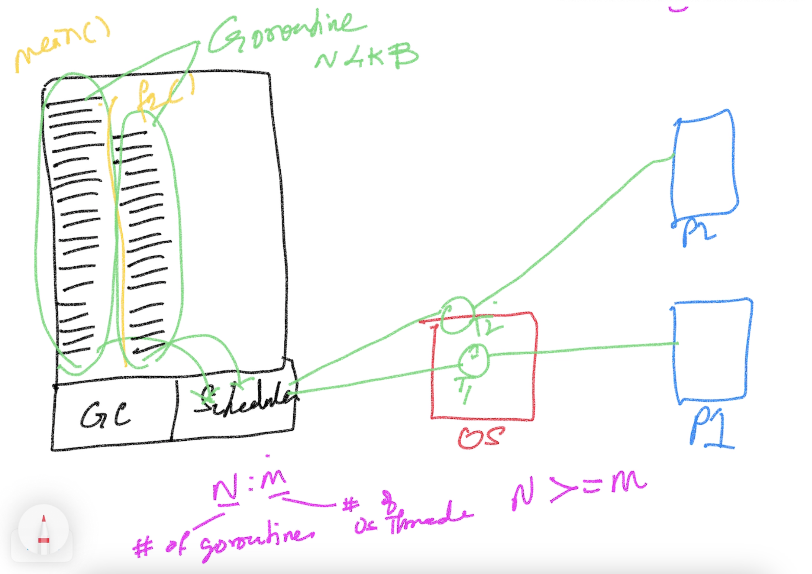
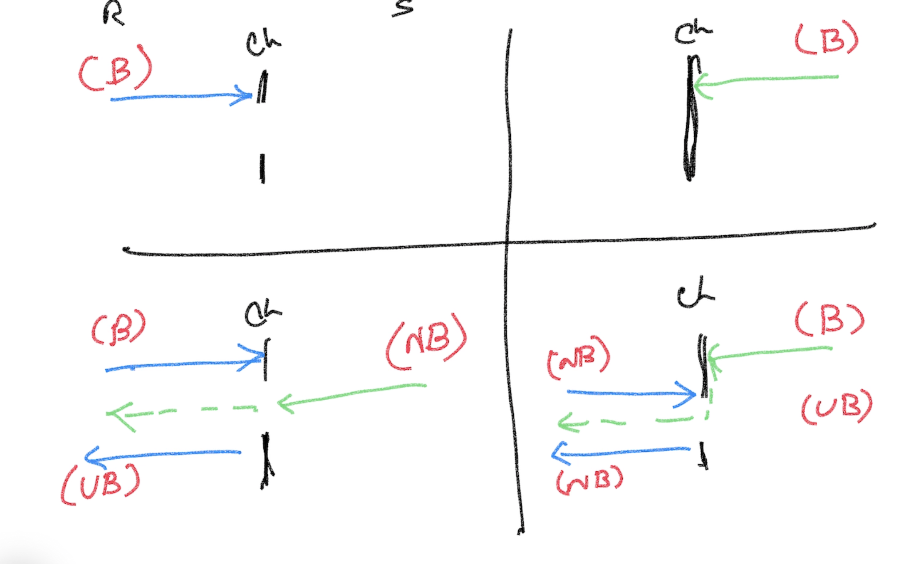

## Advanced Golang ##
- Magesh Kuppan

## Schedule ##
- Commence      : 9:00 AM
- Tea Break     : 10:30 AM (20 mins)
- Lunch Break   : 12:30 PM (1 hour)
- Tea Break     : 3:00 PM (20 mins)
- Wind up       : 5:00 PM

## Methodology ##
- No powerpoint
- 100% Code driven class
- No dedicated Q&A time

## Repository ##
- https://github.com/tkmagesh/cisco-advgo-oct-2023

## Software Requirements ##
- Go Tools
- Visual Studio Code (Or any other editor)
- Go Extension (VS Code) - https://marketplace.visualstudio.com/items?itemName=golang.Go
- Docker Desktop


## Go Basics ##
- Language constructs
- Collection Types (Array, Slice, Map)
- Error handling 
- Deferred functions
- Higher Order Functions
- Panic & Recovery
- Interfaces
- Modules & Packages

- Structs
- Concurrency

## Struct ##
- Value Types
- Can be composed (No inheritence)

## Concurrency ##
- What is Concurrency?
    - Ability to have more than one execution path in an application
- Support for concurrency is offered as a language feature (not thorugh APIs)
    - go keyword, chan data type, chan operator (<-), range construct, select-case construct
- Extensive API support
    - sync package
    - sync/atomic package

- Concurrency Model


- Race Detection
    - go run --race <app>
    - go build --race <app>
    - Note : DO NOT create production builds with race detector

- Communication between goroutines (channels)
    - Channel is a "data type"
    - Declaration
    ```
        var <channel_variable> chan <data_type>
        ex: var ch chan int
    ```
    - Initialize
    ```
        <channel_variable> = make(chan <data_type>)
        ex: ch = make(chan int)
    ```
    - Channel Operations (using channle operator (<-) )
        - Send Operation
        ```
            <channel_variable> <- <value>
            ex: ch <- 100
        ```
        - Receive Operation
        ```
            <- <channel_variable>
            ex: <- ch
        ```
    - Channel Behavior
        - Receive Operation is ALWAYS a blocking operation (operation is blocked until the data becomes available in the channel)
        - Send Operation is blocked until a receive operation is initiated (conditional)
    
    - Buffered Channel
        - A "send" operation can be successful even if a "receive" operation is not initiated
        - Use case:
            "Receive" operation need to be optional
# GRPC #
## GRPC? ##
    - binary serialization
    - smaller payload size when compared to XML & JSON
    - communication patterns
        - request / response pattern
        - client streaming (many requests & one response)
        - server streaming (one request & many responses)
        - bidirectional streaming (many requests & many responses)
    - support for limited number of languages
    - share the service & payload schema beforehand 

## Steps: ##
    - Create service / operations / data contracts using protocol buffers
    - Share the contract between the client & server
    - Generate proxy & stub using the contracts
    - Server
        - implement the service (with the business logic) based on the contract
        - host the service
    - Client
        - Use the proxy to communicate to the service


## Tools Installation ##
    1. Protocol Buffers Compiler (protoc tool)
        Windows:
            Download the file, extract and keep in a folder (PATH) accessble through the command line
            https://github.com/protocolbuffers/protobuf/releases/download/v24.4/protoc-24.4-win64.zip
        Mac:
            brew install protobuf

        Verification:
            protoc --version

    2. Go plugins (installed in the GOPATH/bin folder)
        go install google.golang.org/protobuf/cmd/protoc-gen-go@v1.28
        go install google.golang.org/grpc/cmd/protoc-gen-go-grpc@v1.2